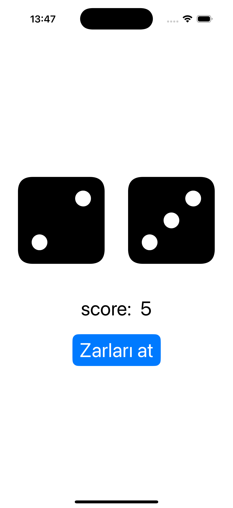

# 🎲 SwiftUI Zar Atma Uygulaması

Bu proje, SwiftUI kullanarak geliştirilen basit bir zar atma uygulamasıdır. Uygulama, iki adet 6 yüzlü zar atmanızı sağlar.

## 🚀 Özellikler

- **İki adet D6 zar içerir** (6 yüzlü zar).
- **Rastgele zar atma** fonksiyonu.
- **SF Symbols ile zar görselleştirme**.
- **Butona basarak zarları yeniden atma**.

## 📸 Ekran Görüntüsü



## 🛠️ Kurulum

Bu projeyi çalıştırmak için Xcode ve SwiftUI gereklidir.

1. **Projeyi klonlayın**:
   ```sh
   git clone https://github.com/gulsumbulbul/ZarUygulamasi.git

